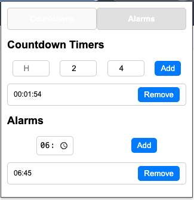

# **Multi Timer - Chrome Extension**

Manage your time with ease using the **Multi Timer** Chrome Extension! This lightweight and interactive tool allows you to set multiple countdowns and alarms directly from your browser.



---

## **Features**

- ⏱️ **Multiple Timers**: Add and manage multiple countdowns and alarms simultaneously.
- 🎯 **Precise Control**: Set timers and alarms with hours, minutes, and seconds.
- 🌙 **Dark Theme**: Sleek black background with a modern design.
- 🚀 **Offline Support**: Works without an internet connection.
- ⚡ **Lightweight**: Minimal impact on your browser's performance.

---

## **How to Install**

### From Source (For Developers):

1. Clone this repository:
   ```bash
   git clone https://github.com/Marcusleeleelee/chrome-extension-timer.git
   ```
2. Open Chrome and navigate to chrome://extensions.
3. Enable Developer Mode (top-right corner).
4. Click Load unpacked and select the project folder.
5. This Multi Timer extension will appear in your toolbar.
